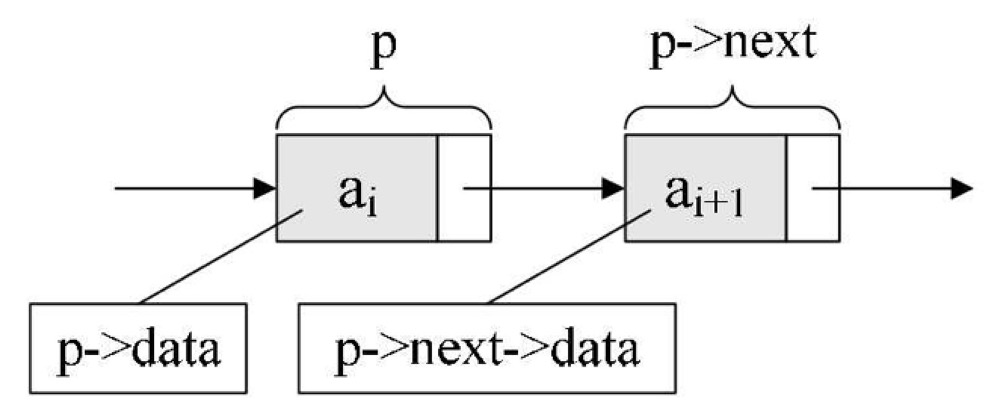
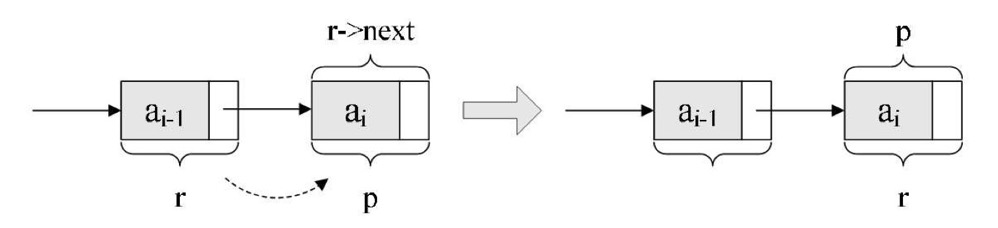
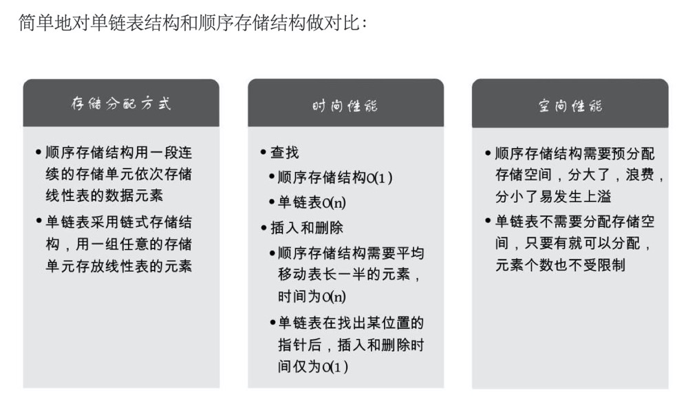

### 线性表
零个或多个数据元素的有限序列。
```
ADT 线性表(List) 
Data
    线性表的数据对象集合为{a1, a2, ......, an}，每个元素的类型均为 DataType。
    其中，除第一个元素 a1 外，每一个元素有且只有一个直接前驱元素，
    除了最后一个元素 an 外，每一个元素有且只有一个直接后继元素。
    数据元素之间的关系是一对一的关系。
Operation
    InitList(*L):          初始化操作，建立一个空的线性表 L。
    ListEmpty(L):          若线性表为空，返回 true，否则返回 false。
    ClearList(*L):         将线性表清空。
    GetElem(L, i, *e):     将线性表 L 中的第 i 个位置元素值返回给 e。
    LocateElem(L, e):      在线性表 L 中查找与给定值 e 相等的元素，
                           如果查找成功，返回该元素在表中序号表示成功；
                           否则，返回 0 表示失败。
    ListInsert(*L, i, e):  在线性表 L 中第 i 个位置插入新元素 e。
    ListDelete(*L, i, e):  删除线性表 L 中第 i 个位置元素，并用 e 返回其值。
    ListLength:            返回线性表 L 的元素个数。
```

---

#### 线性表的顺序存储结构
用一段地址连续的存储单元依次存储线性表的数据元素。

##### 描述顺序存储结构需要三个属性：
- 存储空间的起始位置：数组 data，它的存储位置就是存储空间的存储位置。
- 线性表的最大存储容量：数组长度 MaxSize。
- 线性表的当前长度：length。

##### 地址计算方法：
LOC(ai)=LOC(a1)+(i-1)*c （c 为占用的存储单元）

##### 随机存取结构：
通过这个公式，可以随时算出线性表中任意位置的地址，不管它是第一个还是最后一个，都是相同的时间。
那么对每个线性表位置的存入或者取出数据，对于计算机来说都是相等的时间，也就是一个常数，因此用算法中学到的时间复杂度的概念来说，它的存取时间性能为 O(1)。

---

#### 3.5　顺序存储结构的插入与删除

##### 3.5.1　获得元素操作
```
#define OK 1
#define ERROR 0
#define TRUE 1
#define FALSE 0
typedef int Status;
/* Status是函数的类型，其值是函数结果状态代码，如 OK 等 */
/* 初始条件：顺序线性表L已存在，1 ≤ i ≤ ListLength(L) */
/* 操作结果：用 e 返回 L 中第 i 个数据元素的值 */
Status GetElem(SqList L, int i, ElemType *e) {
     if (L.length == 0 || i < 1 || i > L.length)
         return ERROR;
     *e = L.data[i - 1];
     return OK;
}
```
##### 插入算法的思路：
1. 如果插入位置不合理，抛出异常；
2. 如果线性表长度大于等于数组长度，则抛出异常或动态增加容量；
3. 从最后一个元素开始向前遍历到第 i 个位置，分别将它们都向后移动一个位置；
4. 将要插入元素填入位置i处； 
5. 表长加 1。
```
/* 初始条件：顺序线性表 L 已存在，1 ≤ i ≤ ListLength(L)， */
/* 操作结果：在 L 中第 i 个位置之前插入新的数据元素 e，L 的长度加 1 */
Status ListInsert(SqList *L, int i, ElemType e) {
     int k;
     if (L->length == MAXSIZE)          /* 顺序线性表已经满 */
         return ERROR;
     if (i < 1 || i > L->length + 1)    /* 当i不在范围内时 */
         return ERROR;
     if (i <= L->length)                /* 若插入数据位置不在表尾 */
     {
         for (k = L->length - 1; k >= i - 1; k—)    /*将要插入位置后数据元素向后移动一位 */
            L->data[k + 1] = L->data[k];
     }
     L->data[i - 1] = e;     /* 将新元素插入 */
     L->length++;
     return OK;
}
```

##### 删除算法的思路：
1. 如果删除位置不合理，抛出异常；
2. 取出删除元素；
3. 从删除元素位置开始遍历到最后一个元素位置，分别将它们都向前移动一个位置；
4. 表长减1。
```
/* 初始条件：顺序线性表 L 已存在，1 ≤ i ≤ ListLength(L) */
/* 操作结果：删除 L 的第 i 个数据元素，并用 e 返回其值，L 的长度减 1 */
Status ListDelete(SqList *L, int i, ElemType *e) {
     int k;
     if (L->length == 0)            /* 线性表为空 */
         return ERROR;
     if (i < 1 || i > L->length)     /* 删除位置不正确 */
         return ERROR;
     *e = L->data[i - 1];
     if (i < L->length)             /* 如果删除不是最后位置 */
         {
             for (k = i; k < L->length; k++)    /* 将删除位置后继元素前移 */
                 L->data[k - 1] = L->data[k];
         }
     L->length-—;
     return OK;
 }
```
##### 3.5.4　线性表顺序存储结构的优缺点

优点：
- 无须为表示表中元素之间的逻辑关系而增加额外的存储空间
- 可以快速地存取表中任一位置的元素

缺点：
- 插入和删除操作需要移动大量的元素
- 当线性表长度变化较大时，难以确定存储空间的容量
- 造成存储空间的“碎片”

---

#### 3.6　线性表的链式存储结构（单链表）
线性表链式存储结构代码描述：
```
/* 线性表的单链表存储结构 */
Typedef struct Node {
    ElemType data;
    struct Node *next;
} Node;
Typedef struct Node *LinkList;  /* 定义LinkList */
```

P 是第 i 个元素的指针，数据元素
{
    数据域 p -> data
    指针域 p -> next
}

P -> data = ai;
P -> next -> data = a(i+1);
  


---
#### 3.7 单链表的读取：

获得链表第i个数据的算法思路：
 1.声明一个指针p指向链表第一个结点，初始化j从1开始；
 2.当j<i时，就遍历链表，让p的指针向后移动，不断指向下一结点，j累加1；
 3.若到链表末尾p为空，则说明第i个结点不存在；
 4.否则查找成功，返回结点p的数据。
```
/* 初始条件：顺序线性表 L 已存在，1 ≤ i ≤ ListLength(L) */
/* 操作结果：用 e 返回 L 中第 i 个数据元素的值 */
Status GetElem(LinkList L, int i, ElemType *e)
{
     int j;
     LinkList p;            /* 声明一指针 p */
     p = L->next;           /* 让 p 指向链表 L 的第一个结点 */
     j = 1;                 /* j 为计数器 */
     while (p && j < i)     /* p不为空且计数器j还没有等于i时，循环继续 */
    {
         p = p->next;       /* 让p指向下一个结点 */
         ++j;
     }
     if (!p || j > i)
         return ERROR;      /* 第i个结点不存在 */
     *e = p->data;          /* 取第i个结点的数据 */
     return OK;
 }
 ```
说白了，就是从头开始找，直到第 i 个结点为止。由于这个算法的时间复杂度取决于 i 的位置，当 i = 1 时，则不需遍历，第一个就取出数据了，而当 i = n 时则遍历 n-1 次才可以。因此最坏情况的时间复杂度是 O(n)。

---

#### 3.8　单链表的插入与删除

##### 插入：
s -> next = p -> next;
P -> next = s;

单链表第i个数据插入结点的算法思路：
 1.声明一指针p指向链表头结点，初始化j从1开始；
 2.当j<i时，就遍历链表，让p的指针向后移动，不断指向下一结点，j累加1；
 3.若到链表末尾p为空，则说明第i个结点不存在；
 4.否则查找成功，在系统中生成一个空结点s；
 5.将数据元素e赋值给s->data；
 6.单链表的插入标准语句：s->next=p->next;    p->next=s;
 7.返回成功。

```
/* 初始条件：顺序线性表 L 已存在，1 ≤ i ≤ ListLength(L)， */
/* 操作结果：在 L 中第 i 个结点位置之前插入新的数据元素 e，L 的长度加 1 */
Status ListInsert(LinkList *L, int i, ElemType e)
{
     int j;
     LinkList p, s;
     p = *L;
     j = 1;                 /* 寻找第 i-1 个结点 */
     while (p && j < i)
    {
         p = p->next;
         ++j;
     }
     if (!p || j > i)
         return ERROR;      /* 第 i 个结点不存在 */
     s = (LinkList)malloc(sizeof(Node));     /* 生成新结点（C标准函数） */
     s->data = e;
     s->next = p->next;     /* 将 p 的后继结点赋值给 s 的后继 */
     p->next = s;           /* 将 s 赋值给 p 的后继 */
     return OK;
}
```

##### 删除：
q=p->next; 
p->next=q->next;

单链表第i个数据删除结点的算法思路：
 1.声明一指针p指向链表头结点，初始化j从1开始；
 2.当j<i时，就遍历链表，让p的指针向后移动，不断指向下一个结点，j累加1；
 3.若到链表末尾p为空，则说明第i个结点不存在；
 4.否则查找成功，将欲删除的结点p->next赋值给q；
 5.单链表的删除标准语句p->next=q->next；
 6.将q结点中的数据赋值给e，作为返回；
 7.释放q结点；
 8.返回成功。

```
/* 初始条件：顺序线性表 L 已存在，1 ≤ i ≤ ListLength(L) */
/* 操作结果：删除 L 的第 i 个结点，并用 e 返回其值，L 的长度减 1 */
 Status ListDelete(LinkList *L, int i, ElemType *e) {
     int j;
     LinkList p, q;
     p = *L;
     j = 1;
     while (p->next && j < i)     /* 遍历寻找第 i-1 个结点 */
     {
         p = p->next;
         ++j;
     }
     if (!(p->next) || j > i)
         return ERROR;            /* 第 i 个结点不存在 */
     q = p->next;
     p->next = q->next;           /* 将 q 的后继赋值给 p 的后继 */
     *e = q->data;                /* 将 q 结点中的数据给 e */
     free(q);                     /* 让系统回收此结点，释放内存 */
     return OK;
}
```
---

#### 3.9　单链表的整表创建

创建单链表的过程就是一个动态生成链表的过程。即从“空表”的初始状态起，依次建立各元素结点，并逐个插入链表。

##### 单链表整表创建的算法思路：
 1. 声明一指针p和计数器变量i；
 2. 初始化一空链表L；
 3. 让L的头结点的指针指向NULL，即建立一个带头结点的单链
 4. 循环：
    a. 生成一新结点赋值给p；
    b. 随机生成一数字赋值给p的数据域p->data；
    c. 将p插入到头结点与前一新结点之间。


##### 头插法：
其实用的是插队的办法，就是始终让新结点在第一的位置。简称为头插法。
```
/* 随机产生 n 个元素的值，建立带表头结点的单链线性表 L（头插法） */
void CreateListHead(LinkList *L, int n)
{
     LinkList p;
     int I;
     srand(time(0));        /* 初始化随机数种子 */
     *L = (LinkList)malloc(sizeof(Node));
     (*L)->next = NULL;     /* 先建立一个带头结点的单链表 */
     for (i = 0; i < n; i++)
     {
         p = (LinkList)malloc(sizeof(Node));        /* 生成新结点 */
         p->data = rand() % 100 + 1;                /* 随机生成 100 以内的数字 */
         p->next = (*L)->next;
         (*L)->next = p;                            /* 插入到表头 */
     }
}
```

##### 尾插法：
把每次新结点都插在终端结点的后面，这种算法称之为尾插法。
```
/* 随机产生 n 个元素的值，建立带表头结点的单链线性表 L（尾插法） */
 void CreateListTail(LinkList *L, int n)
 {
     LinkList p, r;
     int I;
     srand(time(0));                        /* 初始化随机数种子 */
    *L = (LinkList)malloc(sizeof(Node));    /* 为整个线性表 */
     r = *L;                                 /* r 为指向尾部的结点 */
     for (i = 0; i < n; i++)
     {
         p = (Node *)malloc(sizeof(Node));   /* 生成新结点 */
         p->data = rand() % 100 + 1;         /* 随机生成 100 以内的数字 */
         r->next = p;                        /* 将表尾终端结点的指针指向新结点 */
         r = p;                              /* 将当前的新结点定义为表尾终端结点 */
     }
     r->next = NULL;                         /* 表示当前链表结束 */
}
```
注意 L 与 r 的关系，L 是指整个单链表，而 r 是指向尾结点的变量，r 会随着循环不断地变化结点，而 L 则是随着循环增长为一个多结点的链表。



它的意思，就是本来 r 是在 ai-1 元素的结点，可现在它已经不是最后的结点了，现在最后的结点是 ai，所以应该要让将 p 结点这个最后的结点赋值给 r。此时 r 又是最终的尾结点了。

---

#### 3.10　单链表的整表删除

单链表整表删除的算法思路如下：
 1. 声明一指针p和q；
 2. 将第一个结点赋值给p；
 3. 循环：
    a. 将下一结点赋值给q；
    b. 释放p；
    c. 将q赋值给p。
```
/* 初始条件：顺序线性表 L 已存在，操作结果：将 L 重置为空表 */
 Status ClearList(LinkList *L) {
     LinkList p, q;
     p = (*L)->next;        /* p 指向第一个结点 */
     while (p) {            /* 没到表尾 */
        q = p->next;
        free(p);
        p = q;
     }
     (*L)->next = NULL;     /* 头结点指针域为空 */
     return OK;
}
```

